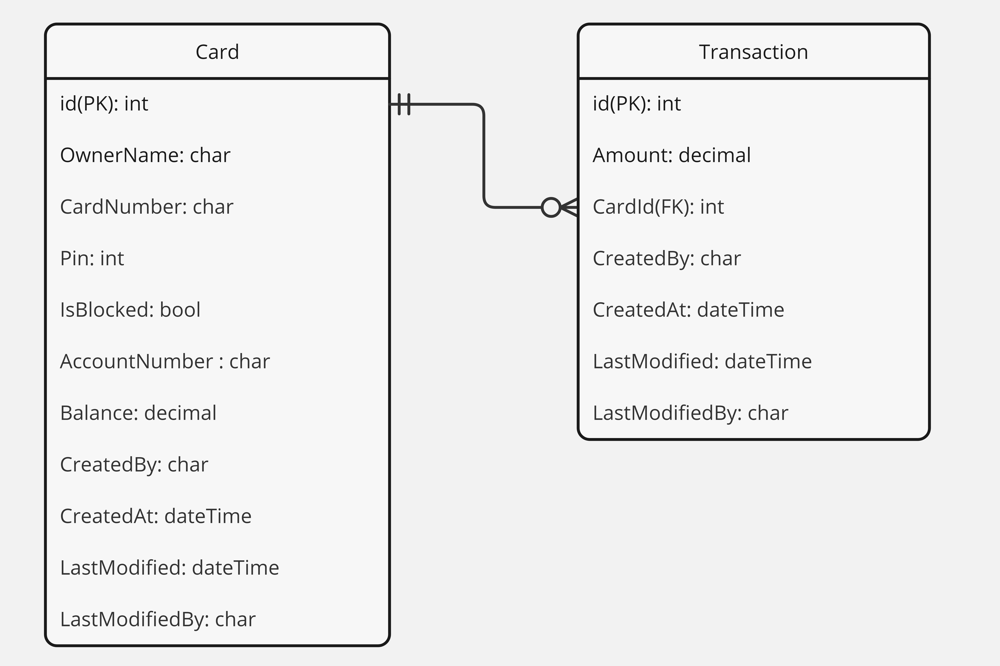

# Atm Web API

Esta es una aplicación web API desarrollada en .NET 8 que proporciona solucion para el challenge enviado por Metafar. En la solucion tambien encontraremos una aplicacion de consola, encargada de realizar las migraciones de la Base de datos.

## Requisitos Previos

Antes de comenzar, asegúrate de tener instalado lo siguiente:
- .NET 8 SDK: [Descargar e Instalar .NET 8 SDK](https://dotnet.microsoft.com/download)
- Docker: [Descargar e Instalar Docker](https://www.docker.com/get-started)

## Instalación y Configuración previa

1. Clona este repositorio en tu máquina local:
    ```bash
    git clone https://github.com/Diegoagf/challenge-atm.git
    ```

2. Asegurate de que este corriendo docker y que te encuentres en el directorio de la aplicación:
    ```bash
    cd challenge-atm
    ```

3. Inicia el contenedor de la base de datos SqlServer utilizando Docker Compose:
    ```bash
    docker-compose up -d
    ```

## Migracion de la base de Datos 

Una vez realizado los pasos anteriores,y este ejecutandose el contenedor de Sql Server, Ejecutar la aplicacion de consola  `Challenge.Atm.DatabaseMigrator`:

- Asegurate estar en el directorio correcto:
    ```bash
    cd ./Challege.Atm.DatabaseMigrator
    ```
- Ejecutar la aplicacion, ya sea por tu IDE de preferencia o mediante Consola:
    ```bash
    dotnet run
    ```
- Se observara en los logs de la aplicacion que se realizaron las migraciones de las base de datos y agregaron algunos datos iniciales a la base

## Diagrama de Entidad-Relacion de modelo(DER)



## Ejecución

Una vez que hayas completado la instalación y configuración, puedes ejecutar la aplicación web api mediante tu IDE de preferencia o mediante la consola:
```bash
 cd ./Challenge.Atm.WebUI
 ```
```bash
 dotnet run
```

## Pruebas
El proyecto cuenta con una pequeña suite de pruebas unitarias , que se puede correr en el IDE de preferencia o mediante consola:
```bash
 cd challenge-atm
 ```
```bash
 dotnet test
```


Finalmente existe una coleccion de postman en el directorio ```Coleccion-Postman``` donde una vez importada se puede probar cada endpoint que expone la api, sin embargo se detalla un resumen de cada endpoint:

- __Login__: Dado un numero de tarjeta y Pin, este devolvera un JWT, el cual identifica ese usuario con esa tarjeta.( Nota: En los siguientes endpoints no hace falta enviar el numero de tarjeta, ya que se encuentra resuelto en el token).
- __Transactions History__: Dado un JWT, este devolvera un historial de las transacciones de ese numero de tarjeta previamente logeado. 
- __Get Balance__: Dado un JWT, este devolvera el saldo de ese numero de tarjeta previamente logeado.
- __Create Transaction__: Dado un JWT,un monto y un tipo de transaccion( deposito o retiro) , creara una transaccion para el numero de tarjeta previamente logeado

Ademas se cuenta con dos endpoints mas que no estan autenticados, para simplemente realizar pruebas con otras tarjetas
- __GetAllCards__: Devolvera todas las tarjetas registradas en el sistema
- __Create Card__: Dado los datos de la tarjetas, se creara una nueva tarjeta al sistema.